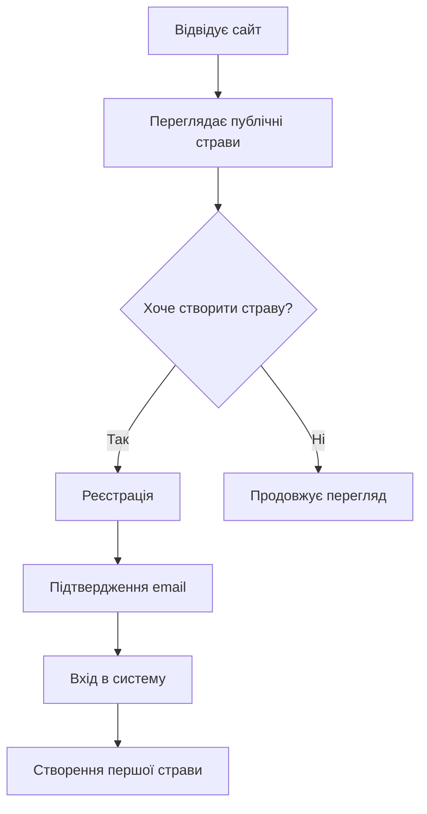
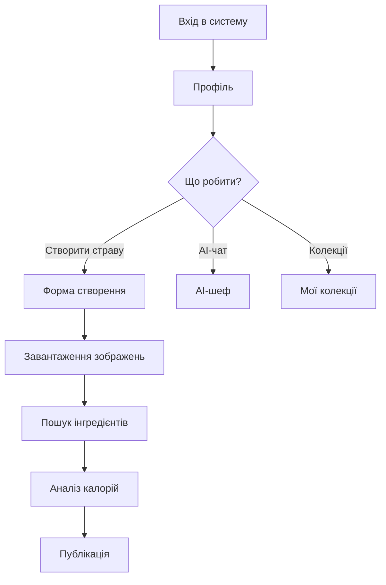
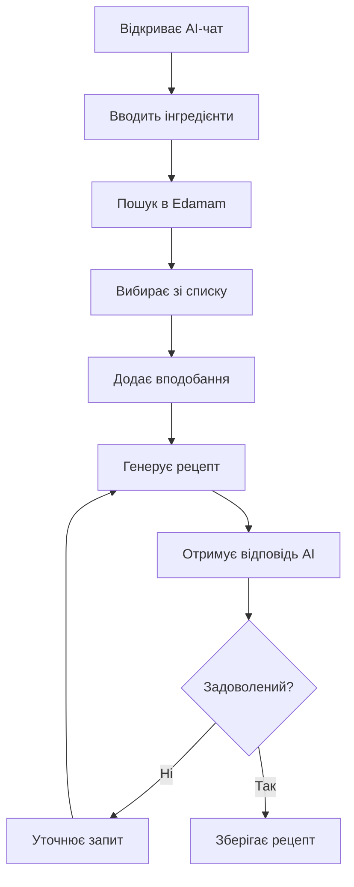
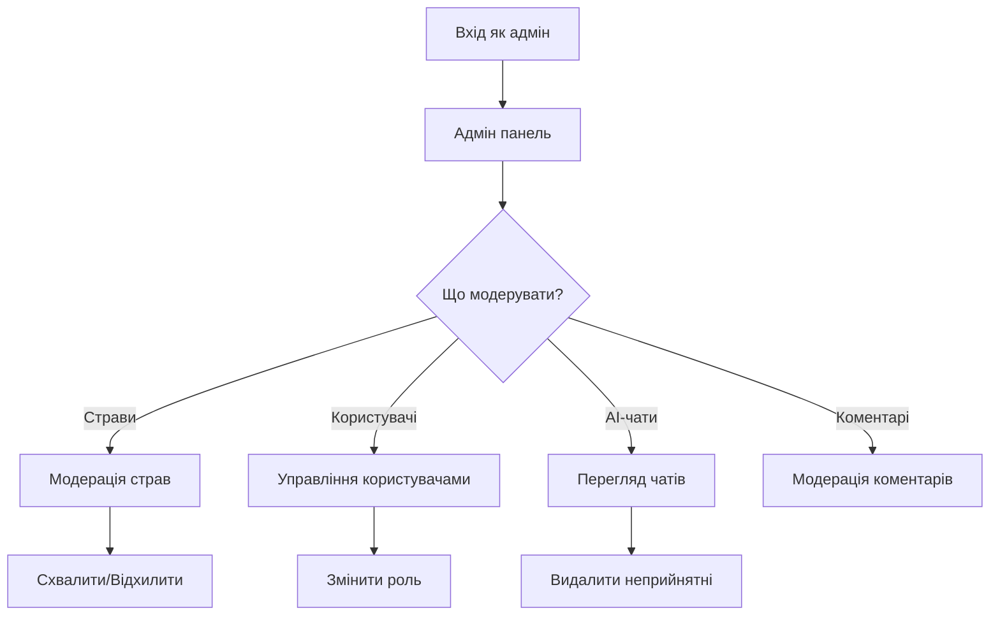

# Потік взаємодії користувача з платформою

## 👤 **Сценарії використання:**

### **1. 🆕 Новий користувач**



**Детальний потік:**
```
1. 🌐 Заходить на головну сторінку
   └── Бачить: статистику, популярні страви, пошук

2. 🔍 Використовує пошук/фільтри
   └── Фільтрує за: категорією, часом, складністю, рейтингом

3. 👁️ Переглядає деталі страви
   └── Бачить: інгредієнти, кроки, автора, коментарі

4. 📝 Вирішує зареєструватися
   └── Форма: email, пароль, повне ім'я

5. 📧 Підтверджує email
   └── Клік по посиланню в листі

6. 🏠 Потрапляє в профіль
   └── Бачить: статистику, швидкі дії
```

---

### **2. 👨‍🍳 Досвідчений користувач**



**Детальний потік створення страви:**
```
1. 📝 Заповнює основну інформацію
   ├── Назва страви
   ├── Опис
   ├── Кількість порцій
   └── Головне зображення

2. 🏷️ Вибирає категорії
   └── Множинний вибір з існуючих категорій

3. 🥕 Додає інгредієнти
   ├── 🔍 Пошук через Edamam API
   ├── 🌐 Автоматичний переклад (DeepL)
   ├── ➕ Додавання вручну
   └── ⚖️ Вказує кількість та одиниці

4. 📊 Аналізує поживність (опціонально)
   ├── Відправляє інгредієнти до Edamam
   ├── Отримує калорії, білки, жири, вуглеводи
   └── Розраховує на порцію

5. 📋 Додає кроки приготування
   ├── Опис кожного кроку
   ├── Час виконання
   └── Зображення кроку (опціонально)

6. 💾 Зберігає як чернетку
   └── Статус: "draft"

7. 📤 Відправляє на модерацію
   └── Статус: "pending"
```

---

### **3. 🤖 AI-шеф взаємодія**



**Технічний потік:**
```
1. 🔍 Пошук інгредієнтів
   User Input → Translation → Edamam API → Results → UI

2. 🤖 Генерація рецепту
   Ingredients → Gemini AI → Markdown Response → Display

3. 💾 Збереження чату
   Messages → PostgreSQL → Chat History

4. 📖 Збереження рецепту
   AI Response → Parse → Create Dish → Database
```

---

### **4. 👑 Адміністратор**



**Адмін функції:**
```
1. 📊 Дашборд
   ├── Статистика користувачів
   ├── Статистика страв
   ├── Активність AI-чату
   └── Загальні метрики

2. 🔍 Модерація контенту
   ├── Страви на розгляді
   ├── Скарги на коментарі
   ├── Підозрілі AI-чати
   └── Звіти користувачів

3. 👥 Управління користувачами
   ├── Зміна ролей (user ↔ admin)
   ├── Блокування акаунтів
   ├── Видалення користувачів
   └── Перегляд активності

4. 🏷️ Управління категоріями
   ├── Створення нових
   ├── Редагування існуючих
   ├── Видалення порожніх
   └── Статистика використання
```

---

## 🔄 **Життєвий цикл страви:**

```
📝 Створення (draft) → 📤 Подача (pending) → 👑 Модерація → ✅ Публікація (approved)
                                                    ↓
                                              ❌ Відхилення (rejected)
                                                    ↓
                                              🔄 Повторна подача
```

### **Статуси та дозволи:**
- **draft** - бачить тільки автор
- **pending** - бачать автор + адміни
- **approved** - бачать всі користувачі
- **rejected** - бачить тільки автор + причина відхилення

---

## 📱 **Responsive дизайн:**

### **Desktop (1200px+):**
- Повна навігація
- Сайдбар в адмін панелі
- Грід 3-4 колонки для страв

### **Tablet (768px-1199px):**
- Згорнута навігація
- Грід 2 колонки
- Адаптивні форми

### **Mobile (до 767px):**
- Мобільне меню
- Одна колонка
- Touch-friendly кнопки
- Swipe жести

---

## ⚡ **Продуктивність:**

### **Оптимізації:**
- **Lazy loading** - зображення завантажуються по потребі
- **Pagination** - по 12 страв на сторінку
- **Debounce** - пошук з затримкою 500мс
- **Caching** - кешування перекладів та API відповідей
- **Image compression** - автоматичне стиснення зображень

### **Offline підтримка:**
- Service Worker для кешування
- Локальне зберігання критичних даних
- Sync при відновленні з'єднання

Ця архітектура забезпечує **масштабованість**, **безпеку** та **відмінний користувацький досвід** на всіх пристроях.